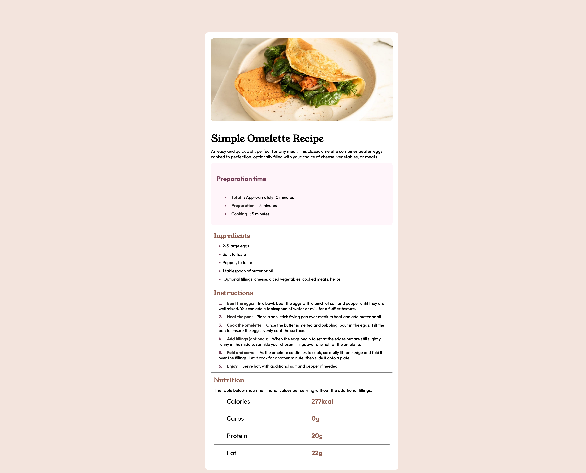
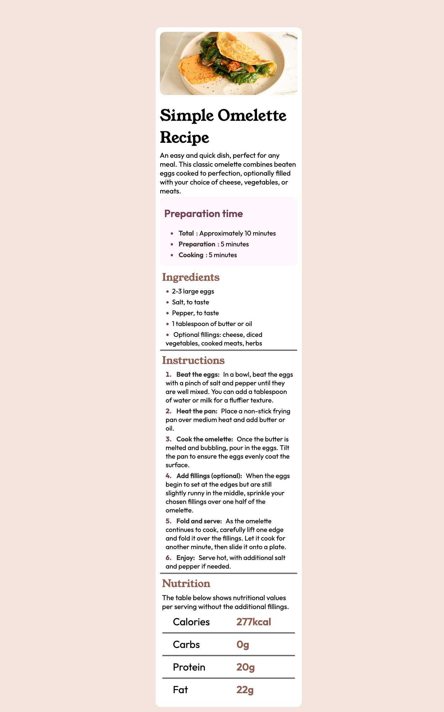

# Frontend Mentor - Recipe page solution

This is a solution to the [Recipe page challenge on Frontend Mentor](https://www.frontendmentor.io/challenges/recipe-page-KiTsR8QQKm). Frontend Mentor challenges help you improve your coding skills by building realistic projects.

## Table of contents

- [Overview](#overview)
  - [The challenge](#the-challenge)
  - [Screenshot](#screenshot)
  - [Links](#links)
- [My process](#my-process)
  - [Built with](#built-with)
  - [What I learned](#what-i-learned)
- [Author](#author)

## Overview

### Screenshot

### Links

- Solution URL: [https://github.com/YugandarNR/Simple-Omlette-Recipe]
- Live Site URL: [https://yugandarnr.github.io/Simple-Omlette-Recipe/]

## My process

### Built with

- HTML5
- CSS

### What I learned

Doing this project helpled me implement css container and div. I also learned to format tables using CSS. Also, I learned to change ordered and un ordered list properties.

## Author

- Website - [Yugandar NR](https://github.com/YugandarNR)
- Frontend Mentor - [@YugandarNR](https://www.frontendmentor.io/profile/YugandarNR)
